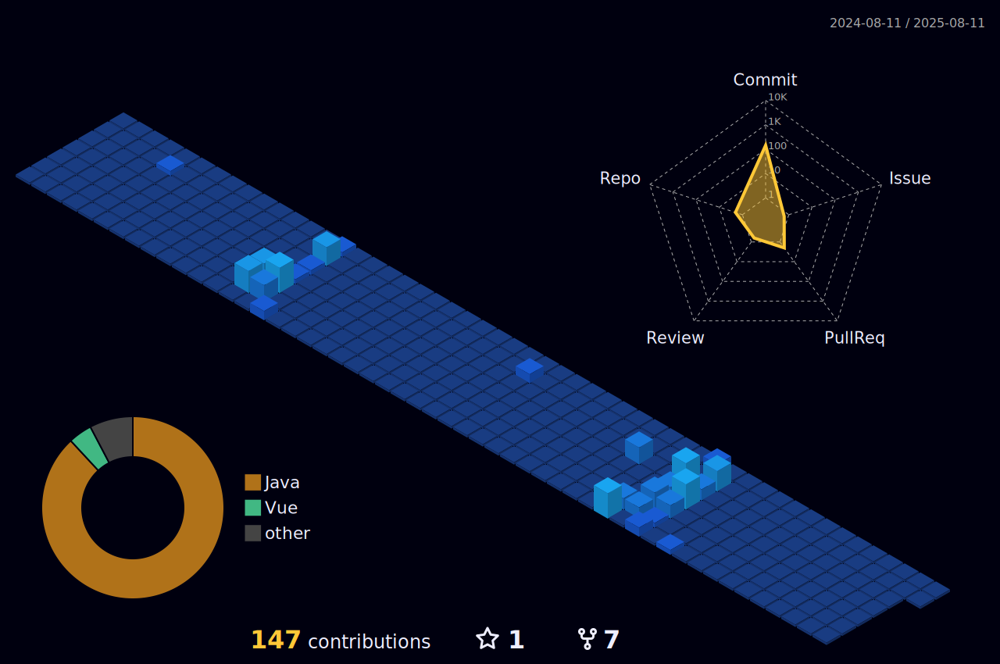

# Olá, seja bem vindo! 😄

Neste perfil, compartilho e aprendo tudo que sei relacionado à programação.

---

* 🧑 Sou acadêmico de Engenharia de Computação;
* 🖥️ Trabalho como Suporte de Sistemas na Unoesc;

## Meus contatos:

   

## Tecnologias:

---

 |  |  |  
 | ----------- | ----------- |

<a href="https://github.com/Tortelli1">

